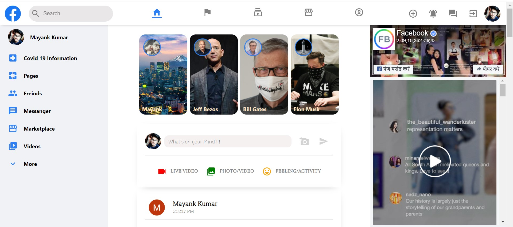
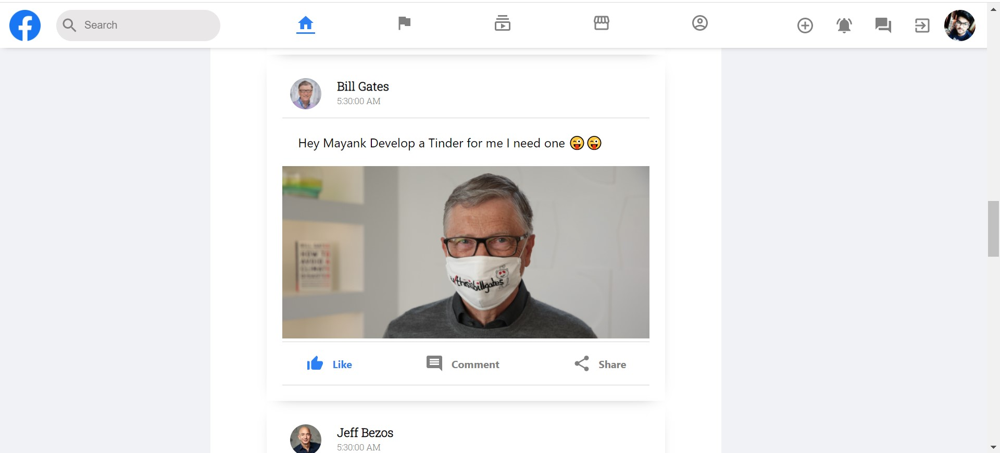
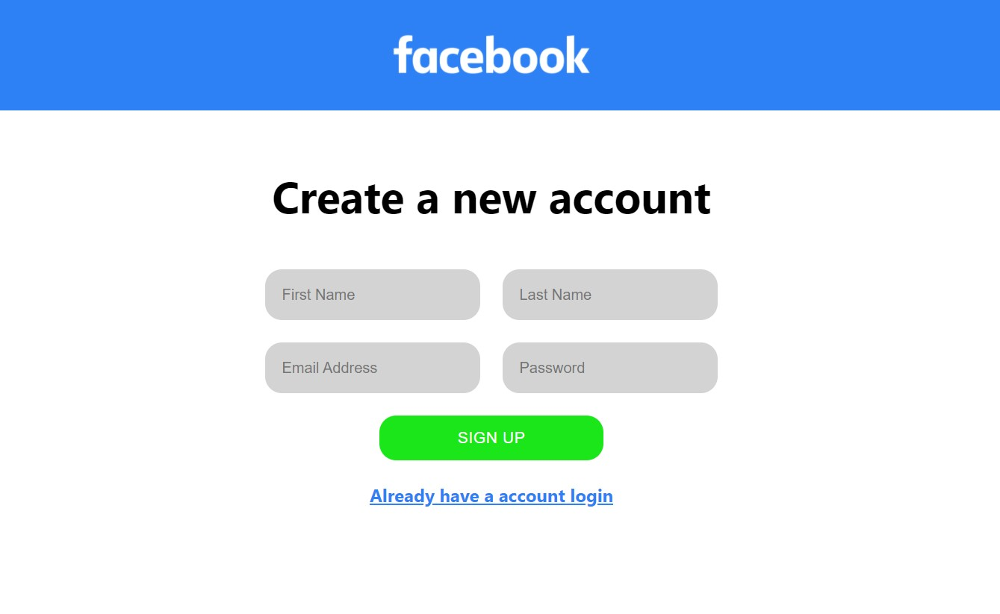

# Facebook Clone

- Its a Facebook look-alike social media web-app implemented through MERN Stack
- It has a custom user login and registration using NodeJS and MongoDB
- It also has Google OAuth authentication
- Realtime Chat Messenger implemented using MERN and Pusher

## App Link
- https://facebook-clone-314905.web.app/

## App Preview

